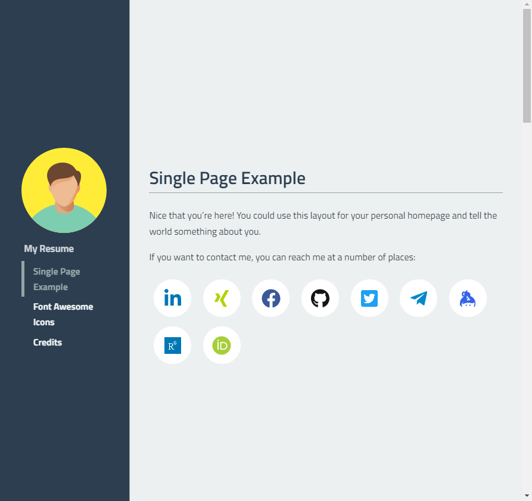
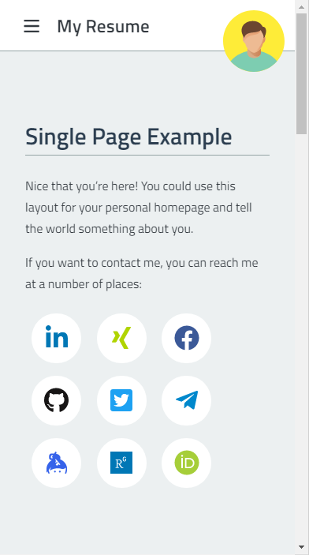
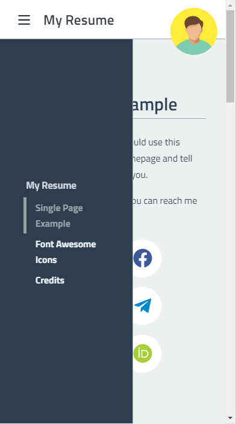

# Single Page VuePress Theme

This these extends the VuePress default theme `@vuepress/theme-default` for a layout for single page sites that contain several sections, each covering at least one view height.
I this this is easier described with a picture:

**Desktop version:**



**Mobile version:**




I developed this theme as the basis for my personal homepage. So it can well be used to put your resume online.

It also defines a couple of social icons that you can use to link to your online profiles.

## Features

* Vue components for social media links as icons, with icons taken from font-awesome
* Predefined components for: Facebook, Twitter, Telegram, LinkedIn, XING, Keybase, ORCID, GitHub, e.g.
  ```md
  <Social-LinkedIn id="petertandler" />
  <Social-GitHub id="ptandler" />
  ```
* Vue components for contact information (email, phone) that generate obfuscated text and links to provide some challenges for harvesting bots and to avoid spam:
  ```md
  <Contact-Phone title="Phone" country="49" city="1234" number="56789" />
  <br/>
  <Contact-Email name="someone" domain="example.com" /> <!-- webmaster is the default name -->
  ```
* Privacy-friendly way to pass sensitive contact information (e.g. mobile number, private email, messanger name) via URL in (e.g.) email footer - that will 
  be included in the homepage exactly as the other icons. Some information can be passed directly in VuePress:
  ```md
  <Contact-DetailsContainer
    :email_as_icon="false" 
    :phone_as_icon="false"
    linkedin="petertandler"
    xing="Peter_Tandler"
    github="ptandler"
    keybase="ptandler"
    twitter="PeterTandler"
    researchgate="Peter_Tandler"
    />
  ```
  If called like: https://ptandler.github.io/vuepress-theme-single-page-sections/?email=myname@example.com&skype=mySkypeId

## Example

In the [`example` directory](./example/README.md), there is a simple sample project.

You can see this live at https://ptandler.github.io/vuepress-theme-single-page-sections/

## Setup

This theme uses VuePress v1.

Install the theme:

```cmd
yarn install -D vuepress-theme-single-page-sections
```

## Usage

In your `.vuepress/config.js` include `theme: "single-page-sections"`. And I recommend the following `themeConfig`. The themeConfig comes from the default theme.

```js
module.exports = {
  theme: "single-page-sections",
  themeConfig: {
    sidebar: "auto",
    search: false,
    smoothScroll: true,
    social: { monochrome_icons: false },
    editLinks: false,
    nextLinks: false,
    prevLinks: false,
  },
}
```

And on the pages that should contain several sections use the following frontmatter:

```md
---
title: Page Title...
pageClass: sections-layout
sidebarImage: /small-image.jpg
---

<PageSection id="welcome" title="First Section">

Some content...

</PageSection>

---

::: section Second Section

Some content... this time using the markdown "custom container" syntax.

:::
```

The `sidebarImage` is optional. If defined, this image is included in the sidebar above the navigation links. In the mobil version, it is included in the navbar instead, as the sidebar is hidden then.

## Customization

The colors used are defined in `styles\palette.styl` and can be customized to fit your personal preferences.


## Implementation

This theme overwrites two components from the default theme:

- `components/Navbar.vue`
- `components/Sidebar.vue`
